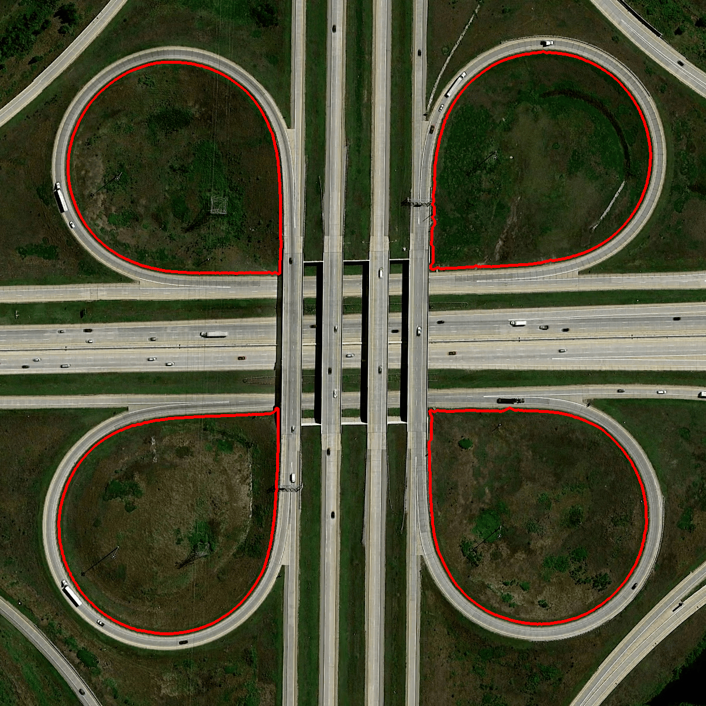

# Image Processing 
A bunch of problem statements and experiments involving digital image processing and simple classification, done as a part of Assignment 1 of the Computer Vision course (IIIT-Hyderabad, Spring '25). 

## Setup 
The conda environment file is available at `docs/env.yml`.  
```sh 
conda env create -f env.yml
```

Alternatively, install the dependencies by referring to those in `docs/env-hist.yml`. 
```
```

## Problems  

### Cloverleaf Bridge 

The initial image is available in `./Cloverleaf Bridge/data/cloverleaf_interchange.png`. 


#### Results 
The final image with contour borders marked is as below: 


The circles within the contours are marked below:


#### Run 
To see the images along with all intermediate pre-processing, run as follows: 
```sh 
cd Cloverleaf\ Bridge
python -m q1
```
```
```


### Line Segmentation in Historical Documents 
to run line segmentation
```sh
python -m q2 
```

### MLP Classification on Image Features 
to run mlp classification:
```sh 
python -m src.q3 --transform <transform> 
```

before that process the data using:
```sh 
python scripts/process.py 
```
